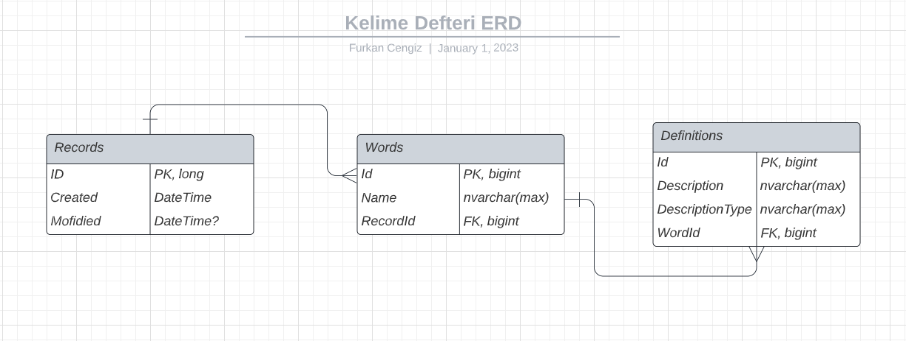

# KelimeDefteri API

## Introduction

- It is created for consumption of KelimeDefteri2 made with Angular.

### What I used so far

    =>  EF Core 7
    =>  MsSql
    =>  AutoMapper
    =>  Fluent Validation
    =>  MediatR
    =>  XUnit
### Security
    => CORS allowed for all origins and methods for now.
    => RateLimiter enabled using FixedWindow Algorithm.

### Table Relations



### Requests and Responses

#### Create Record

##### Request

````
POST {host}/api/wordbook
````

##### Request Body

````json
{
  "words": [
    {
      "name": "string",
      "definitions": [
        {
          "definition": "string",
          "definitionType": "string"
        }
      ]
    }
  ]
}
````

##### Response Message

````js
201 Created
````

##### Response Body

````json
{
  "created": "string",
  "words": [
    {
      "name": "string",
      "definitions": [
        {
          "definition": "string",
          "definitionType": "string"
        }
      ]
    }
  ]
}
````

##### Error Responses

````js
Code: 400 BadRequest | Message: {Validation Error}
````

----------------------------

#### Get Record By Id

##### Request

````
GET {host}/api/wordbook/{id}
````

##### Response Message

````js
200 OK
````

##### Response Body

````json
{
  "created": "string",
  "words": [
    {
      "name": "string",
      "definitions": [
        {
          "definition": "string",
          "definitionType": "string"
        }
      ]
    }
  ]
}
````

##### Error Responses

````js
Code: 404 NotFound | Message: "Record with provided id is not found"
````
--------------------------------

#### Get Record By Word Or Date

##### Request

````
GET {host}/api/wordbook/{search:string}
````

##### Response Message

````js
200 OK
````

##### Response Body

```json
{
  "created": "string",
  "words": [
    {
      "name": "string",
      "definitions": [
        {
          "definition": "string",
          "definitionType": "string"
        }
      ]
    }
  ]
}
```

##### Error Responses

````js
Code: 404 NotFound | Message: "Record with provided date or word is not found"
````
````js
Code: 400 BadRequest | Message: "Given word has multiple records, please provide date instead."
````
------------------
#### LastRecord

##### Request

````
GET {host}/api/wordbook/last
````

##### Response Message

````js
200 OK
````

##### Response Body

````json
{
  "created": "string",
  "words": [
    {
      "name": "string",
      "definitions": [
        {
          "definition": "string",
          "definitionType": "string"
        }
      ]
    }
  ]
}
````
##### Error Responses

````js
Code: 404 NotFound | Message: "Last record doesn't exist yet."
````
